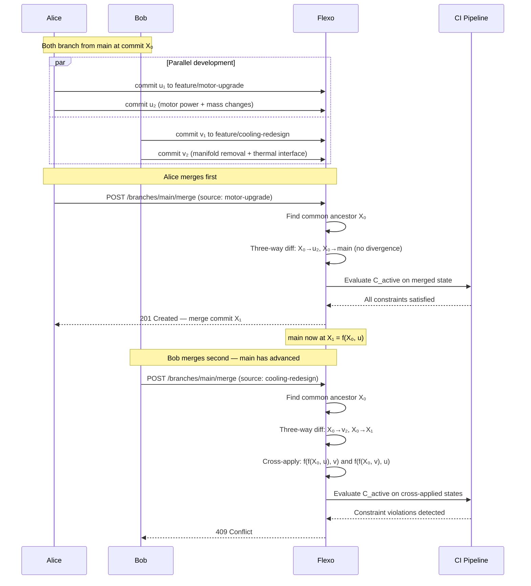
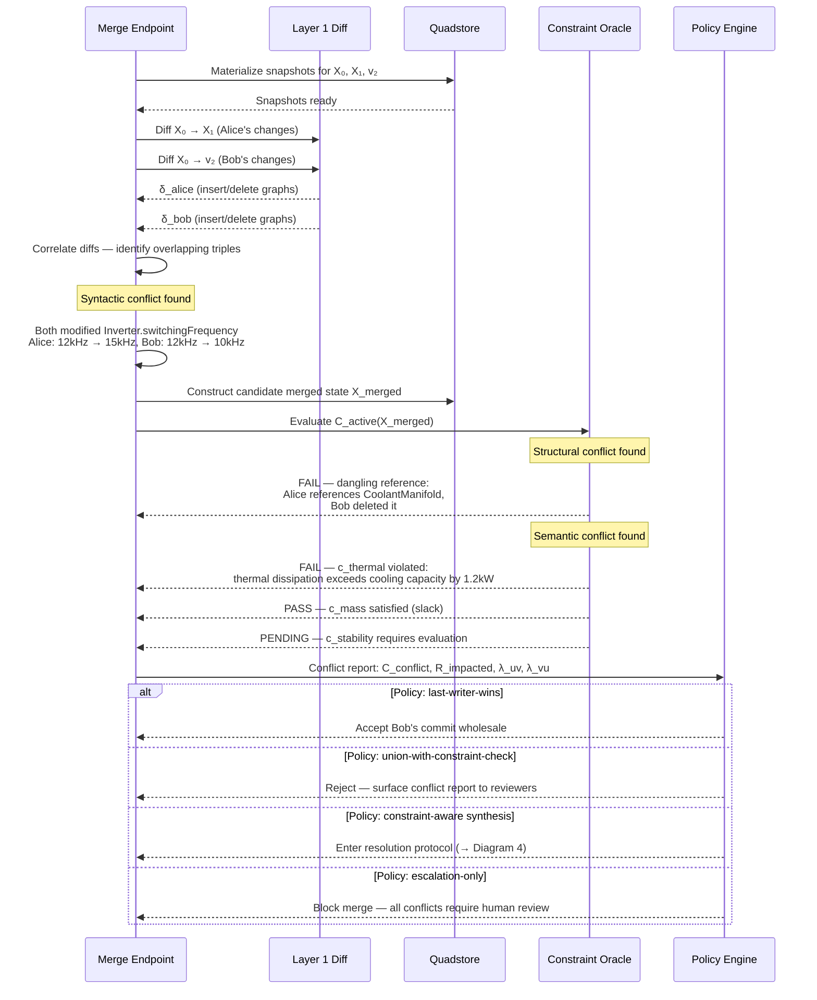
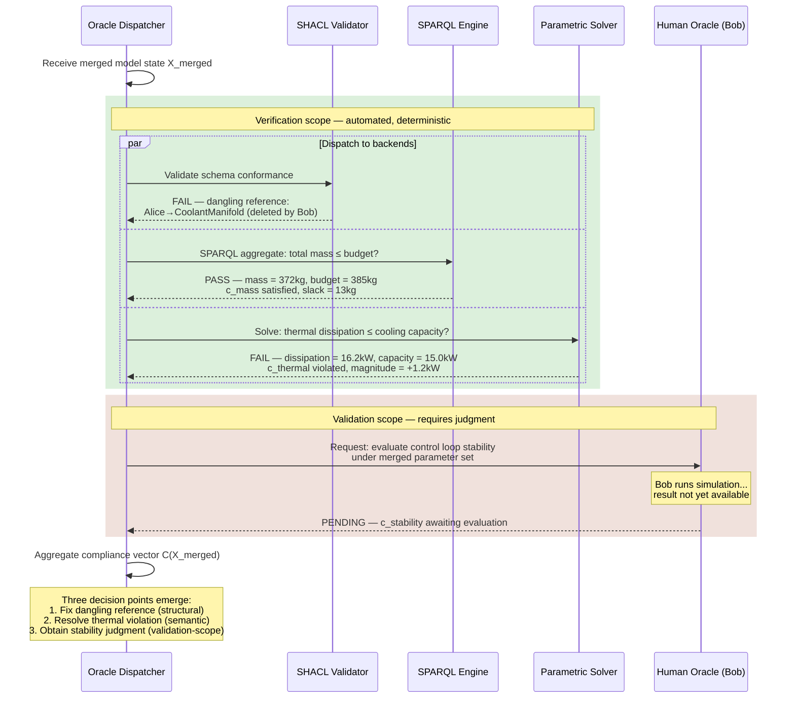
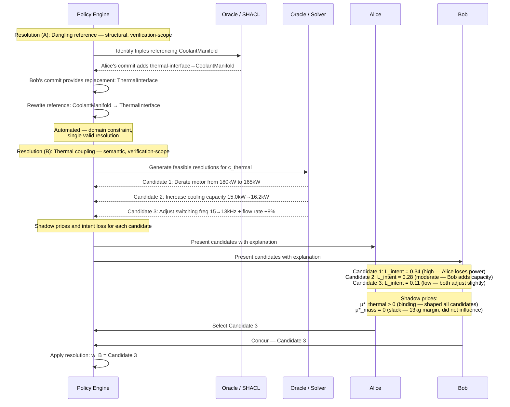
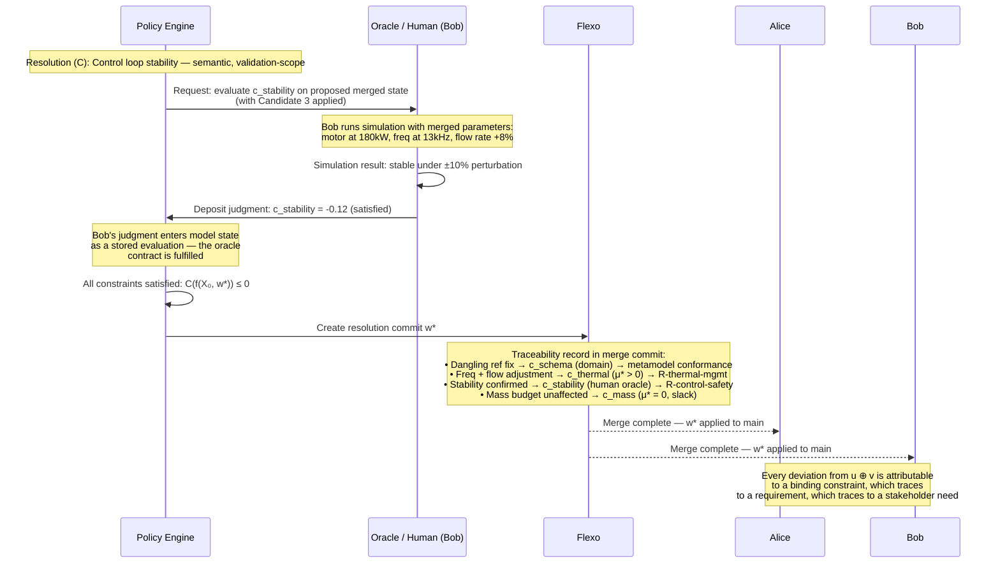
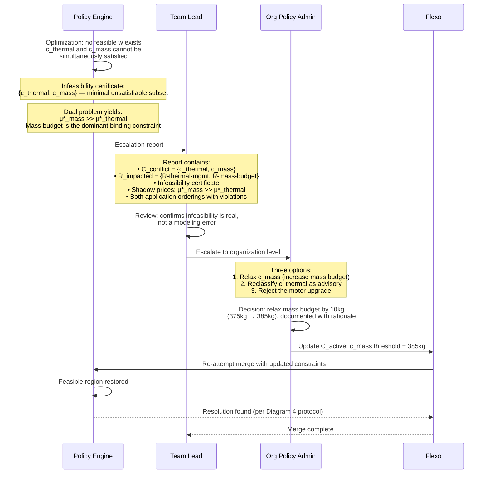

The [[Conflict Resolution Problem Statement]] defines *what* conflict resolution must achieve — constraint satisfaction, intent preservation, explainability through shadow prices. The [[Flexo Conflict Resolution Mapping]] maps those concepts to concrete Flexo operations. This note shows *how it unfolds in time*: the temporal sequence of branching, divergence, detection, evaluation, and resolution as a human-machine protocol. The vehicle is a set of sequence diagrams, grounded in a concrete scenario, that progressively reveal the decision points and information flows that emerge when parallel work produces conflicts.

Each diagram builds on the previous one. Diagram 1 establishes the baseline lifecycle — parallel branches, clean merge. Diagram 2 introduces conflict detection and classification. Diagram 3 zooms into constraint evaluation and the [[Verification and Validation|V&V]] boundary. Diagram 4 shows how resolutions are synthesized with full explainability. Diagram 5 shows what happens when no valid resolution exists and governance must respond. Together, they make the lifecycle legible from end to end.

---

## The Scenario

An electric vehicle powertrain [[Model|model]] is stored in Flexo. Five components — DriveMotor, Inverter, BatteryPack, CoolingSystem, ControllerUnit — are connected by typed relationships (power interfaces, thermal interfaces, control signals) and governed by coupling constraints that span subsystem boundaries.

Two engineers work on the model concurrently:

| Engineer | Branch | Changes |
|----------|--------|---------|
| **Alice** | `feature/motor-upgrade` | Upgrades DriveMotor: higher power rating, increased mass, different switching frequency on Inverter |
| **Bob** | `feature/cooling-redesign` | Redesigns CoolingSystem: removes old CoolantManifold, adds new ThermalInterface, adjusts flow rates |

Each engineer's changes are individually valid — Alice's upgraded motor passes all constraint checks on her branch, and Bob's redesigned cooling system passes all checks on his. The conflicts emerge only when their work must be reconciled.

Five constraints connect their work, spanning the full range of evaluation mechanisms described by the [[Predicate Compliance Oracle]]:

| Constraint | Category | Oracle Backend | [[Verification and Validation\|V&V]] Scope | Automated? |
|------------|----------|---------------|-----------|------------|
| Schema conformance (metamodel) | Domain | SHACL | Verification | Yes |
| Referential integrity (no dangling refs) | Domain | [[SPARQL]] ASK | Verification | Yes |
| Thermal dissipation $\leq$ cooling capacity ($c_{\text{thermal}}$) | Optimization | External solver | Verification | Yes |
| Total subsystem mass $\leq$ budget ($c_{\text{mass}}$) | Optimization | SPARQL aggregate | Verification | Yes |
| Control loop stability under parameter variation ($c_{\text{stability}}$) | Optimization | Simulation / human review | Validation | **No** |

The first four constraints are verification-scope: computable, deterministic, automatable. The fifth — control loop stability — is validation-scope: it requires Bob to run a simulation or exercise engineering judgment, and deposit the result where the system can use it. This heterogeneity is not an implementation detail. It is structural, and the lifecycle must accommodate it.

---

## Diagram 1: Parallel Work and Transparent Merge

The baseline lifecycle. Alice and Bob branch from `main`, work in parallel, and attempt to merge. Alice merges first — her changes compose cleanly with `main`, so the merge is transparent: no constraints violated, no modifications to her commit, $w = u \oplus v$. When Bob requests his merge, the system detects that `main` has advanced (it now includes Alice's changes), and conflict detection begins.

**What this establishes.** The `par` block makes parallel work visible as a first-class structural feature. Alice's merge demonstrates the *transparency property* from the formalism: when $\mathcal{C}_{\text{conflict}} = \emptyset$, the [[Policy|policy]] does not modify the commits. The result is $X_1 = f(X_0, u)$ — the merge commit that applies Alice's changes $u$ to the common ancestor $X_0$. When Bob requests his merge, `main` is now at $X_1$, not $X_0$, so the system must evaluate both application orderings: $f(X_1, v)$ and $f(f(X_0, v), u)$. Bob's 409 is the entry point for everything that follows — the system has detected that the commits interact, but it has not yet classified how or proposed what to do about it.

**Operational levels visible.** Individual (Alice and Bob making commits), Team (branch workflow, [[Continuous Integration|CI]] as the enforcement mechanism).

**What this deliberately elides.** The nature of the conflicts, the constraint evaluation details, and the resolution protocol. Those are the next three diagrams.

---

## Diagram 2: Conflict Detection and Classification

Zooming into the 409. The merge endpoint has identified that constraints are violated, but the [[Conflict Classification|conflict taxonomy]] distinguishes three kinds — each with different detection mechanisms and different resolution characteristics.

**What this reveals.** Three distinct conflict types, each detected differently:

- **Syntactic** (Inverter.switchingFrequency): visible in the diff correlation — both branches modified the same triple. Detectable from $\delta_{\text{alice}}$ and $\delta_{\text{bob}}$ alone.
- **Structural** (dangling reference to CoolantManifold): invisible from diffs — appears only when the merged state is checked against the metamodel via the oracle.
- **Semantic** ($c_{\text{thermal}}$ violated): invisible from diffs and from schema checks — requires evaluating the merged state against a parametric constraint via an external solver.

The `alt` block makes the [[Policy|policy family]] visible. The same conflict report feeds into different protocols depending on the organization's configuration $\theta$. For the remainder of this note, we follow the *constraint-aware synthesis* path — the most information-rich policy.

**Legibility.** The conflict report now contains: $\mathcal{C}_{\text{conflict}}$ (which constraints are violated), $\mathcal{R}_{\text{impacted}}$ (which requirements are affected via the satisfaction relation $c_i \vdash r_j$), and the violation vectors $\lambda_{uv}$, $\lambda_{vu}$ from both application orderings.

---

## Diagram 3: Oracle Dispatch Across the V&V Boundary

The previous diagram treated the oracle as a single box. In practice, the [[Predicate Compliance Oracle]] is a composite — a dispatch over predicate types to heterogeneous evaluation backends. Some respond in milliseconds. Some take seconds. One requires a human to run a simulation, make a judgment, and deposit the result. This heterogeneity is not incidental — it is the architectural manifestation of the [[Verification and Validation|V&V]] boundary.

**What this reveals.** The oracle is not a gate that opens or closes. It is a *process* with different temporal characteristics for different predicates:

- SHACL and SPARQL return immediately — binary, deterministic, no human in the loop.
- The parametric solver returns in seconds with a *magnitude* ($+1.2\text{kW}$), not just pass/fail. This continuous-valued score is what makes shadow prices meaningful — you need a gradient to compute sensitivity.
- The stability check is *pending*. Bob must run an experiment, exercise judgment, and deposit the result. The system cannot proceed to full resolution until this oracle responds, but it can begin resolving the verification-scope conflicts in the meantime.

The two `rect` regions make the V&V boundary architecturally visible. Everything in the green region is computable and can be part of a [[Continuous Integration|CI]] pipeline. Everything in the amber region requires human participation — CI can *require* it but cannot *perform* it.

**Operational levels visible.** Organization (configured which oracle backends are available and which constraints are in $\mathcal{C}_{\text{active}}$), Team (set the solver timeout and review workflow), Individual (Bob serves as the human oracle for $c_{\text{stability}}$).

---

## Diagram 4: Resolution as Human-Machine Protocol

The payoff. Three conflicts must be resolved, each through a different mechanism — but all within the same protocol. The machine evaluates constraints, computes candidates, and presents structured information. The humans exercise judgment where the machine cannot. Every deviation from the ideal composition $u \oplus v$ is explained.

### 4a: Verification-Scope Resolutions

**What this reveals.** Resolution (A) is fully automated — a dangling reference has exactly one sensible fix when the replacement component is identifiable, and no human judgment is needed. Resolution (B) is where the formalism pays off. Three candidates, each with:

- **Intent loss** $L_{\text{intent}}(w; u, v)$: how far each candidate deviates from the ideal composition. Candidate 3 has the lowest intent loss because both engineers contribute a small adjustment rather than one absorbing all the compromise.
- **Shadow prices** $\mu^*$: $\mu^*_{\text{thermal}} > 0$ tells Alice and Bob that the thermal constraint is *binding* — it actively shaped every candidate. $\mu^*_{\text{mass}} = 0$ tells them the mass budget is *slack* — satisfied with margin, irrelevant to this resolution. This is complementary slackness in action.

Alice and Bob are not choosing blindly. They see *which constraints matter*, *how much each candidate deviates from their intent*, and *why*. The machine cannot rank the candidates for them — that requires judgment about which deviation is more acceptable — but it gives them the information to choose well.

### 4b: Validation-Scope Resolution and Final Merge

**What this reveals.** Resolution (C) demonstrates the human oracle protocol. The system cannot evaluate $c_{\text{stability}}$ — it requires Bob to run an experiment. But the protocol structures this interaction: the system requests the evaluation against a specific model state (the one with Candidate 3 applied), Bob performs the evaluation, and the result enters the model state as a stored value. Once deposited, the stability score is operationally identical to any automated constraint score — the formalism treats it uniformly.

The traceability record in the merge commit is the *explainability payoff*. Every deviation from the ideal composition $u \oplus v$ is attributable:

$$w^* \neq u \oplus v \implies \exists\, c_i \text{ with } \mu^*_i > 0 \text{ and } c_i \vdash r_j$$

No unexplained modifications. The dangling reference fix traces to schema conformance. The frequency and flow rate adjustments trace to the thermal management requirement via the binding thermal constraint. The stability confirmation traces to the control safety requirement via Bob's judgment. The mass budget is slack — it did not influence the resolution and carries no attribution.

---

## Diagram 5: Infeasibility and Escalation Across Levels

An alternative scenario. Suppose the organization had recently tightened the mass budget from 385kg to 375kg — and Alice's motor upgrade adds 12kg. Now $c_{\text{thermal}}$ and $c_{\text{mass}}$ are mutually unsatisfiable: every resolution that fixes the thermal violation (by adjusting cooling capacity or motor parameters) pushes mass over budget, and every resolution that respects mass requires cutting motor power below the upgrade's minimum viable threshold. No valid resolution exists.

**What this reveals.** Infeasibility is not a system failure — it is *information*. The dual problem, even when the primal is infeasible, produces an **infeasibility certificate**: the minimal set of constraints that cannot be simultaneously satisfied. The shadow prices tell you *which constraint is most responsible* — here, $\mu^*_{\text{mass}} \gg \mu^*_{\text{thermal}}$ says the mass budget is the dominant obstacle. This is actionable: it directs attention to the right [[Policy|policy]] decision.

The escalation chain makes all four [[Flexo MMS#Engineering Operations Levels|operational levels]] visible:

- **Individual**: Alice and Bob produced the commits that interact.
- **Team**: The Team Lead reviews the escalation report, confirms the infeasibility is genuine (not a modeling error or stale constraint), and escalates upward.
- **Organization**: The Org Policy Admin makes the governance decision — adjusting $\mathcal{C}_{\text{active}}$ is a policy change, not a modeling change. The decision is documented with rationale, and the consequences are immediately visible: the feasible region is restored, and the merge proceeds.
- **Ecosystem**: (implicit) The OMG [[SysML v2]] API conformance, [[RDF]] data format, and protocol standards are unaffected by the policy adjustment — [[Rules and Norms|rules]] at the ecosystem level are invariant under organizational policy changes.

The shadow prices make the *cost of policy choices visible*. If the mass budget consistently produces high shadow prices or infeasibility, that is evidence the policy should be revisited — not at the individual or team level, but at the organizational level where it was set. The formalism surfaces this evidence; the governance structure routes it to the right decision-maker.

---

## Connecting the Layers

The five diagrams tell a single story in progressive detail. Each reveals a dimension of complexity that the previous one elided:

| Diagram | Conflict Types | Formalism Concepts | Operational Levels | V&V Boundary | Information Surfaced |
|---------|---------------|-------------------|-------------------|-------------|---------------------|
| 1 — Parallel Work | None (happy path) → detected | $f(X, u)$, $u \oplus v$, transparency | Individual, Team | — | Conflict exists (409) |
| 2 — Classification | Syntactic, structural, semantic | $\lambda_{uv}$, $\lambda_{vu}$, $\mathcal{C}_{\text{conflict}}$, $g_\theta$ | Individual, Team | Implicit | Conflict report: what, where, which requirements |
| 3 — Oracle Dispatch | — (evaluation detail) | $C(X)$, oracle as composite | Organization, Team, Individual | **Architecturally visible** | Compliance vector with magnitudes and pending items |
| 4 — Resolution | All three resolved | $L_{\text{intent}}$, $\mu^*$, $\nu$, complementary slackness | Individual (as reviewers + oracle) | Verification automated, validation via human oracle | Shadow prices, intent loss, candidate ranking, traceability |
| 5 — Escalation | Infeasible | Infeasibility certificate, dual problem | **All four** | Policy change restores feasibility | Certificate, dominant shadow price, governance options |

Two properties hold across all diagrams and deserve emphasis:

**Legibility.** Conflicts become progressively more legible as you move through the diagrams. Diagram 1 surfaces only existence (409). Diagram 2 adds classification and constraint identity. Diagram 3 adds violation magnitudes. Diagram 4 adds shadow prices, intent loss, and the full traceability chain. Diagram 5 adds infeasibility certificates and governance attribution. At no point is a conflict opaque — the system always tells you what is wrong, why it matters, and what your options are.

**Intent preservation.** The intent loss $L_{\text{intent}}(w; u, v) = d_X(w, u \oplus v) + \gamma \cdot \|w\|_{\text{complexity}}$ provides a distance heuristic for ranking alternatives. Every candidate resolution is measured against the ideal composition of both contributors' changes. The resolution that minimizes intent loss is the one that deviates least from what Alice and Bob each intended; Alice and Bob need not select the lowest scoring alternative as they are the ultimate arbitrators of their intents. Shadow prices explain *why* any deviation was necessary — because a constraint was binding. Requirement prices trace that necessity to a stakeholder need. The result is a merge commit where nothing is changed without reason, and every reason is documented.

---
← [[Flexo MMS]] · [[Conflict Resolution Problem Statement]] · [[Flexo Conflict Resolution Mapping]]
